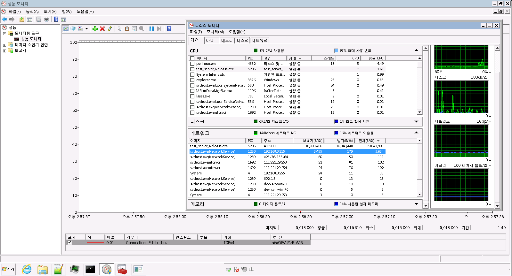
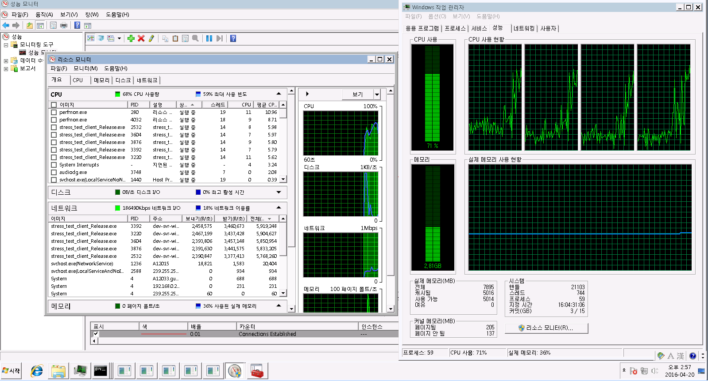

## 서비스화 [EnvironmentService를 사용시에 한정]
* 설치 : 실행파일.exe /install
* 제거 : 실행파일.exe /uninstall

## flatbuffers
flatbuffer를 사용하기 위해서는 몇가지 
FlatBuffersPtr
LinearNormalBuffer를 이용해, FlatBuffer로 변환된 데이터들의 life-cycle을 보장해주는 클래스다.
FlatBuffers의 변환은, 해당 데이터의 사본을 만드는 것이 아니라, 해당 메모리를 그대로 읽는다. (GetRoot 메소드에 넘긴 버퍼는, 리턴 된 포인터가 유효할 때 까지 유효 해야 한다.)

그래서 그렇게 동작 할 수 있게 (다른 스레드나, 다른 함수 등으로 인자로 넘길 때도 life-cycle이 유지 될 수 있게끔)  

## FlatBuffersHelper
flatbuffer를 안정하게 사용하게 도와주는 함수들로 구성되어있다.

이 중에서도 특히 parsing 메소드를 통해 안전하다 확인된 버퍼에 대해서 만 사용해야 한다. 반드시!

## redis
redis의 publisher/subscriber 기능만 구현되어있다.

redis/redisclient.sln 솔루션을 참고하라.

사용한 라이브러리는 [redisclient](https://github.com/nekipelov/redisclient)이다.

lambda로 callback을 받는데, io_service thread에서 호출 된다는 점을 명심하라.
일반 콜백과 다르게, stack 변수를 그대로 사용할 수 없다.
사본으로 life-cycle을 유지해야 한다.

## light-net
C++ 기반의 IOCP 서버 라이브러리이다.
Network.xml에 정의된 변수 기반으로 동작한다.
light-net.h 상단에 있는 상수들도 큰 영향을 준다.

Threading 룰은 light-net/readme.md를 참고하면 된다.

lock 정책은 spin_lock을 구현해 사용한다. [spin_lock.h]

thread간 겹치는 변수에 대한 접근 및 변경은 std::atomic을 통해 처리한다.

함수 네이밍 정책은, 사용은 동사. callback은 on_동사를 사용한다. 

예를 들어, 요청 : receive, 콜백 : on_receive 처럼 짝을 지어 구성된다.

## light-net 
이 문서에서는 iocp에 대해서만 설명한다.

* Session : connection 맺은 대상과 1:1 대응되는 객체. GQCS와 직접적인 IO를 처리한다.
* IOCPWorker : GQCS를 물고 있는 클래스.
* Listener : TCP 포트를 열어 통신하기 위한 클래스. 주로 서버에서 사용한다. Session을 수용 가능한 사용자 수 만큼 생성.
 light::net::Listener::AllocThread()에 넘긴 인자 만큼 Worker를 생성한다.
  넘어온 인자와 별개로 1개 스레드를 따로 생성해서, Accept 전용 스레드로 사용.
* Acceptor : connection 요구 수용을 위해, accept를 걸기 위해 사용되는 객체. Listener를 통해서 만 사용한다.
* Connector : TCP 서버와 connection을 맺기 위해 사용되는 객체. Session을 1개만 들고 있음. 서버 <-> 서버의 Connection 용으로 써도 된다.
* light::net::Connector::AllocThread()에 넘긴 인자 만큼 Worker를 생성한다. Connector용으로는 1개를 권장한다.
* Peer : Session과 1:1 대응되는 객체다. 상속을 통해 확장을 유도하며, network 이벤트를 수신 할 수 있게 강제한다.

### 주요 메소드
* on_connect : 접속 완료 시 호출 되는 메소드.
* on_receive : verify를 통해 split 된 단위로 호출되는 메소드. 주의 할 점은 Session의 Iocp Receive 버퍼의 포인터가 그대로 넘어온다는 점이다. 
* 이후에도 사용하려는 데이터나, 다른 스레드로 데이터를 넘기는 경우에는 반드시 복사해서 사용해야 한다.
* on_disconnect : 소켓 끊겼을 때 불려지는 메소드.
* verify : 유효한 패킷인지 검증하는 함수다. 오버로딩 안 했을 때는, PACKET_HEADER의 사이즈 검증만 한다.
* disconnect : 접속 해제 요청 메소드
* reuse : peer에 대한 사용이 모두 완료되어, 해당 peer (&session)을 재 사용해도 된다고 알리는 메소드.
* send : 패킷 전송 메소드.

## relay_servers
릴레이 서버는 light와 light-net을 이용해 구현되었다.

기본적인 주의 사항은 위 라이브러리들의 주의 사항 위주로 읽으면 된다.

한 가지 추가적인 주의 사항은 threading에 대한 주의 사항이다.

두 가지 thread가 존재한다.
1. redis thread
2. network threads [on_recieve]

부하 분산을 위해, channel 별로 thread를 가른다.
그래서 strand_post_job 시에 주의가 필요하다.

* 채널 생성 및 관리 등 채널에 접근하는 스레드 지정 -> channel_manager_strand_position
* 해당 채널 내의 스레드 지정 -> channel_strand_position

